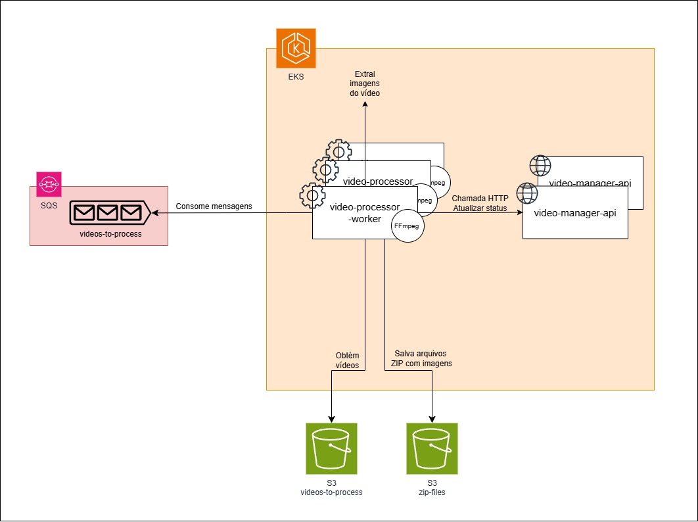

# Video Processor

Microsserviço responsável pelo processamento assíncrono de videos. Reponsável por monitorar a fila de videos aguardando processamento e realizar a extração de imagens dos vídeos, comprimindo-as em um arquivo zip e publicando em um repositório de arquivos para download.

# Funcionalidades
- Extração de imagens de arquivos de video.

# Stack
- .NET 8.0
- SQS
- MassTransit
- S3
- XUnit
- lib FFMPEG

# Arquitetura 
O Serviço é um worker que fica escutando uma fila de videos aguardando processamento. Foi construído utilizando arquitetura hexagonal para organização interna. Utiliza a lib [FFmpeg](https://www.ffmpeg.org/) para o processamento dos videos.
A aplicação integra com a video-manager para notificação de quando os videos são processados. A aplicação é pronta para publicação em um cluster Kubernetes, permitindo assim o processamento de vários videos simultaneamente.



# Como executar o projeto
Por depender de alguns serviços da AWS, o setup necessita de uma conta com alguns recursos para utilização.

## Pré-requisitos
- Docker
- Buckets S3 para armazenamento de vídeos e arquivos ZIP
- Conta AWS com permissão para criação e consumo de filas no SQS

1. Na raiz do projeto, execute o comando
```
docker compose up
```

# Testes
Para executar os testes da aplicação, basta rodar o comando abaixo na raiz do projeto:
```
dotnet test
```
